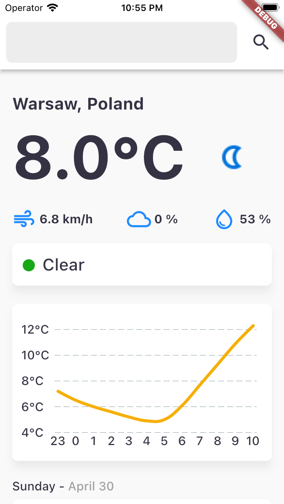
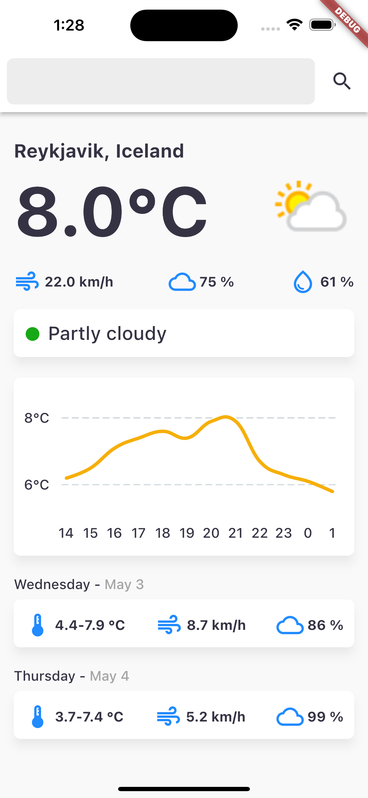

# weatherapp

## Description

The assignment is to create a (simple) weather app using the following free API: https://www.weatherapi.com

- The app needs to show current heat, wind and cloud cover
- The app needs to show the same for tomorrow 
- Extra points for a graphical representation of the data
- Extra point for a graph of predicted temperatures for the next 12 hours
- Extra points for showing a notification on device at 8 in the morning if it is going to rain during the day (>=70% chance)

### Technical side

- Needs to be implemented using bloc architecture from the flutter_bloc package
- Extra points for adding tests
- It can be either emailed with a Zip of the project or a link to a git repo on GitHub or GitLab or any of the git repo services.

## Solution

### How to run?
1. Add environment variable called `WEATHER_API_KEY` with api key from https://www.weatherapi.com/my/.
2. Run `flutter pub run build_runner build --delete-conflicting-outputs`.
3. Run flutter app using CLI or in VSC use `mobile/.vscode/launch.json` build configuration.

### Visual inspiration
I loosely followed design created by Monty Hayton - https://dribbble.com/shots/9245257-Weather-App-Forecast

### Screenshots

